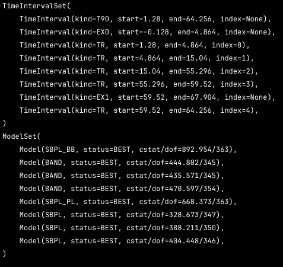
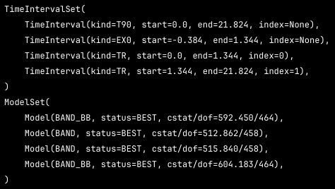
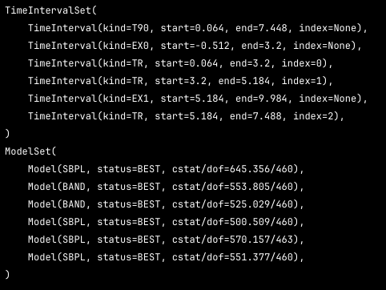
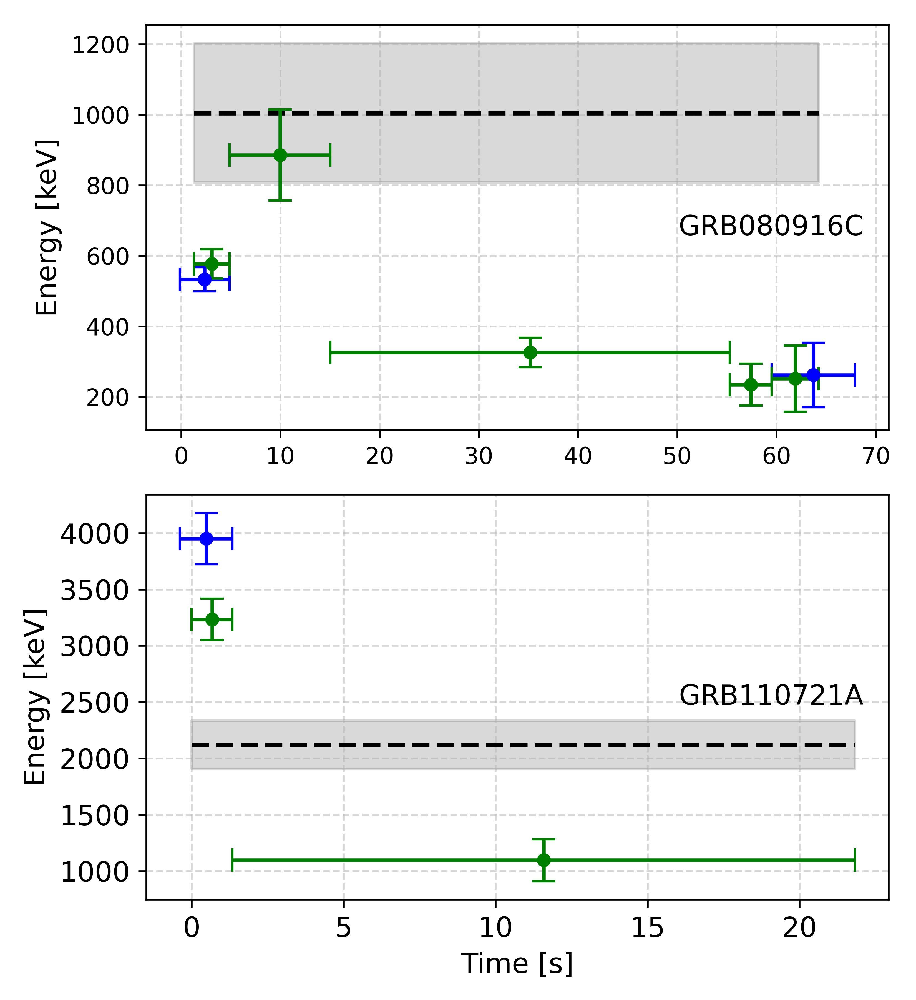
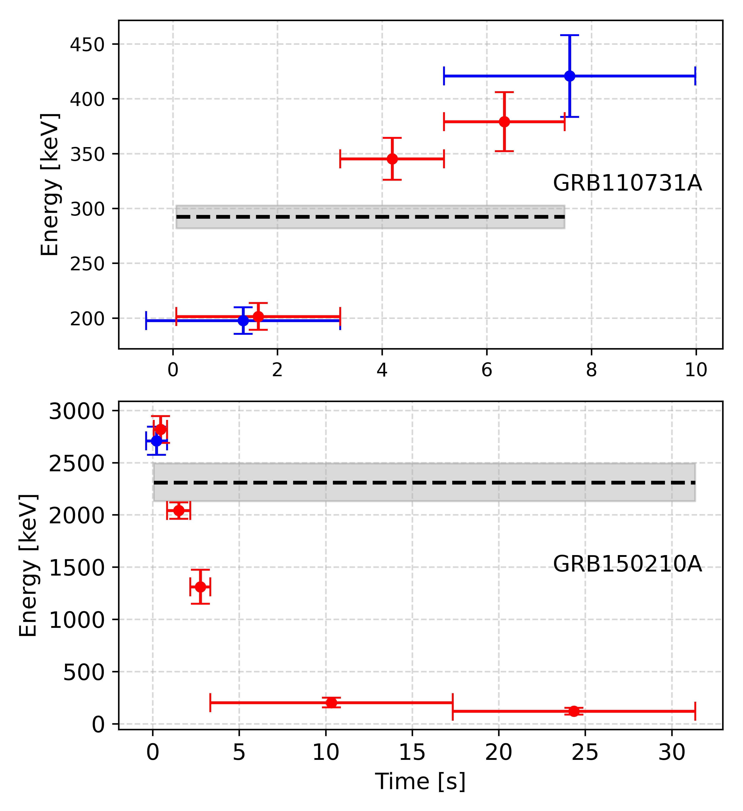
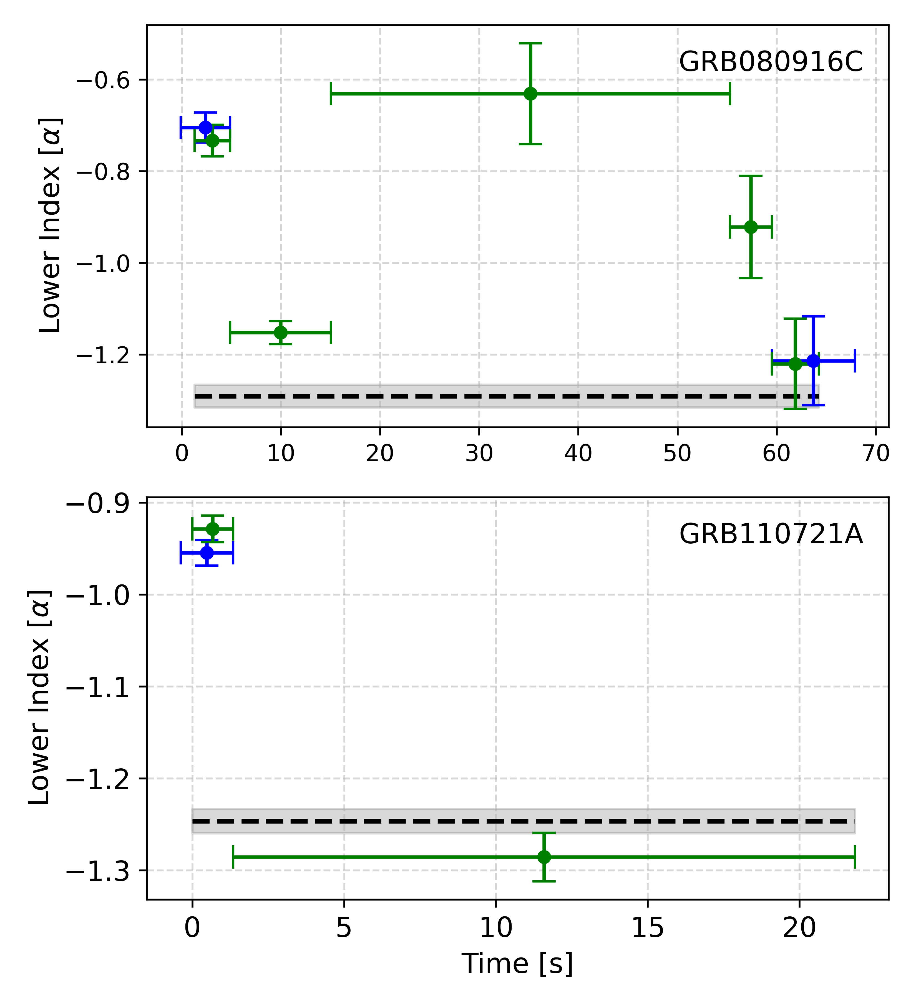
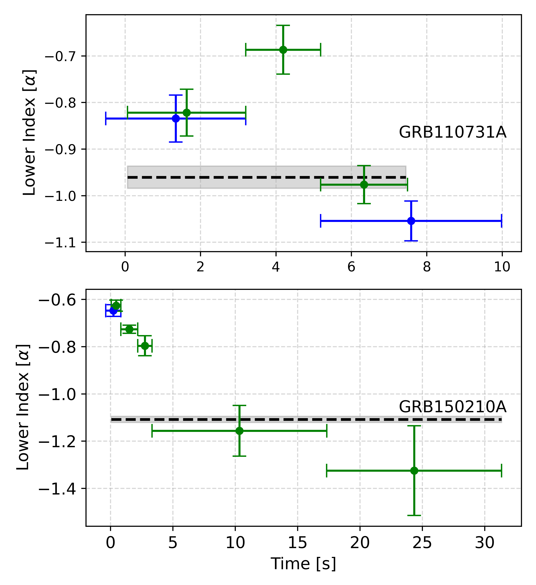
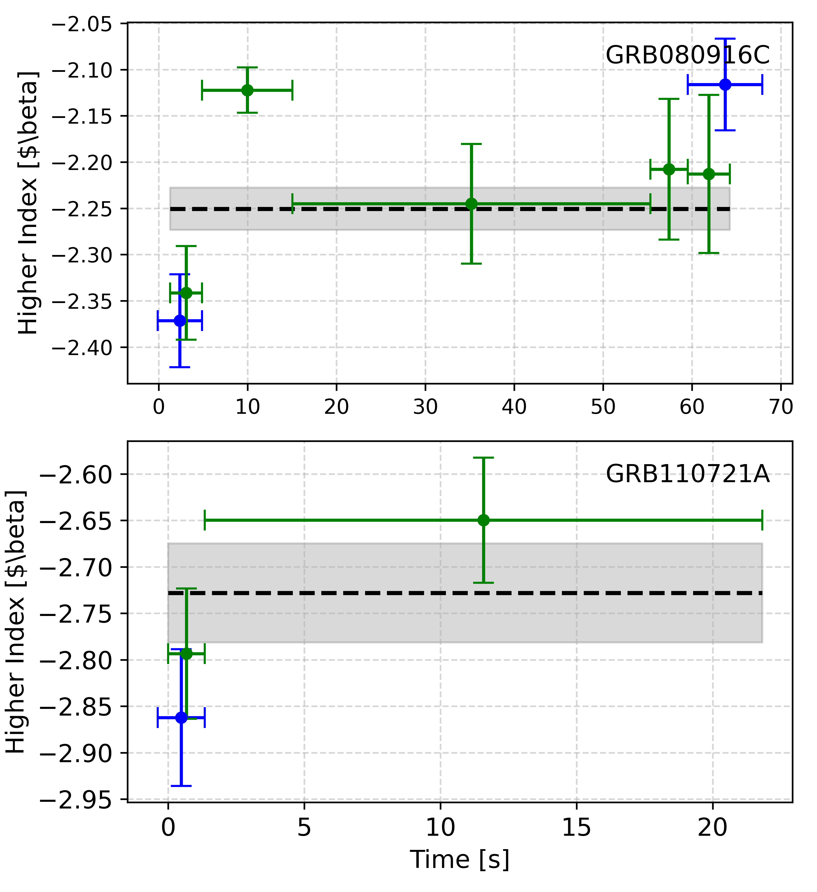
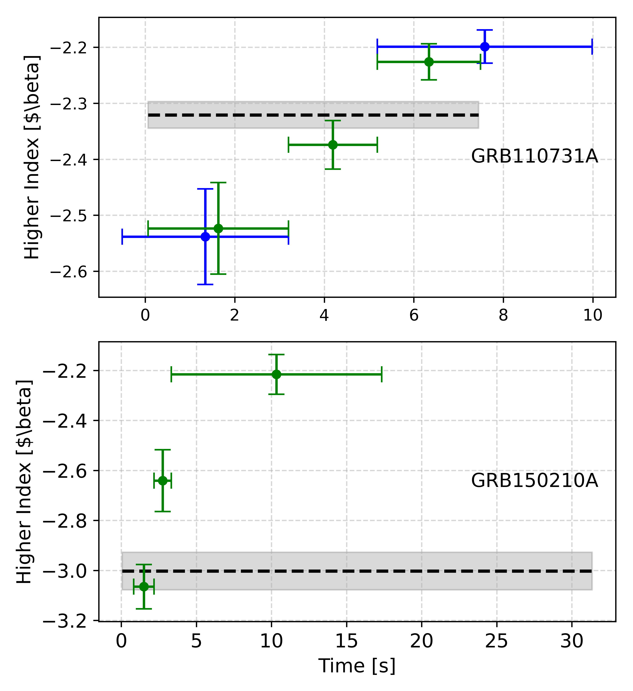

# Date: Dec 31, 2025

## GRB080916C

### best models across all time slots

## GRB110721A

### best models across all time slots

## GRB110731A

### best models across all time slots

## GRB150210A

### best models across all time slots

# Date: Jan 2, 2026

1. peak energy evolution plots for all the best models in the GRBs. 

# Date: Jan 3, 2026

1. low index evolution plots for all the best models in the GRBs.

2. high index evolution plots for all the best models in the GRBs.

